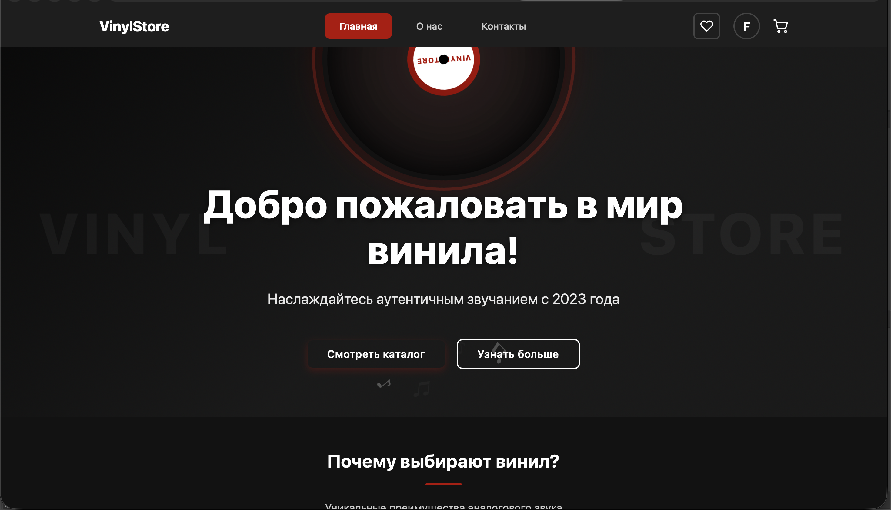
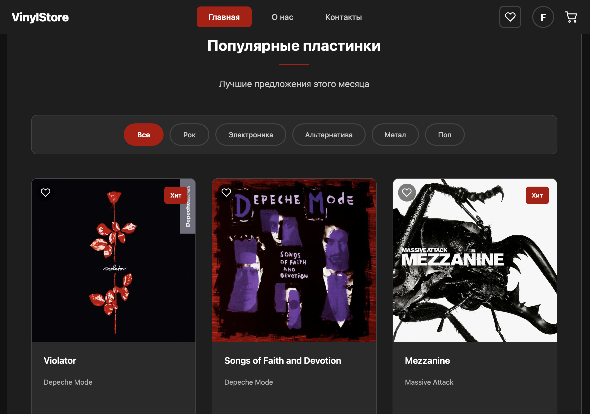
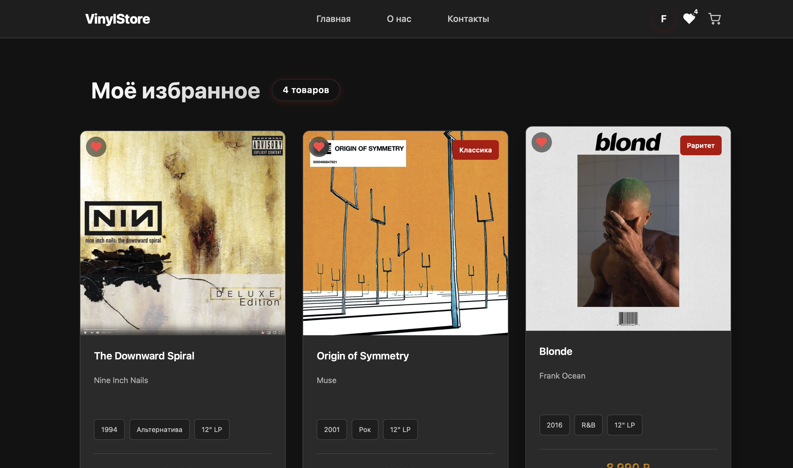
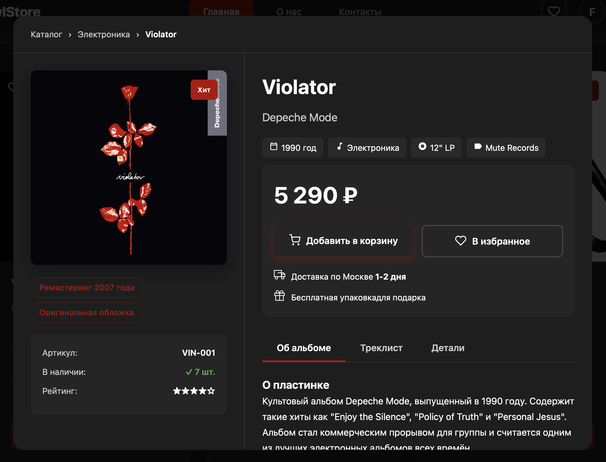

# 🎵 Vinyl Store - Магазин виниловых пластинок с AI-рекомендациями


## О проекте

**Vinyl Store** - это полноценный интернет-магазин виниловых пластинок с уникальной системой рекомендаций на основе искусственного интеллекта. Проект создан для ценителей аналогового звука, которые хотят не просто покупать пластинки, а открывать для себя новую музыку, идеально подходящую под их вкус.

### ✨ Ключевые особенности

- 🎸 **Каталог виниловых пластинок** с фильтрацией по жанрам, году, цене
- 🤖 **AI-рекомендации** на основе музыкального теста и поведения пользователя
- 🧬 **Vinyl DNA** - персональный музыкальный профиль
- ❤️ **Избранное** для сохранения понравившихся пластинок
- 🛒 **Корзина покупок** с возможностью оформления заказа
- 👤 **Профиль пользователя** с историей покупок и рекомендациями
- 📱 **Адаптивный дизайн** для всех устройств

---

## Скриншоты

### Главная страница

*Главная страница с виниловым hero-экраном*

### Каталог товаров

*Католог пластинок магазина с фильтрацией пл жанрам*

### Избранное

*Страница с сохранёнными пластинками*

### Детальная карточка товара

*Детальная информация о пластинке с возможностью добавить в избранное*

---

## Технологический стек

### Frontend
- **React 18** - библиотека пользовательских интерфейсов
- **CSS Modules** - стилизация компонентов
- **Axios** - HTTP-запросы
- **React Router** - навигация
- **Context API** - управление состоянием

### Backend
- **Node.js** - среда выполнения
- **Express** - веб-фреймворк
- **JWT** - аутентификация
- **bcryptjs** - хеширование паролей
- **OpenAI API** - генерация персонализированных описаний

### База данных
- **JSON-файлы** - хранение данных (продукты, пользователи)

---

## AI-рекомендации

Система рекомендаций использует комбинацию нескольких подходов:

1. **Коллаборативная фильтрация** - поиск пользователей с похожим вкусом
2. **Content-based filtering** - анализ жанров, настроения, эстетики
3. **OpenAI GPT** - генерация персонализированных описаний

### Как это работает:
1. Пользователь проходит музыкальный тест 🧬
2. Система создаёт его **Vinyl DNA** (вектор предпочтений)
3. AI анализирует покупки похожих пользователей
4. Генерируются персонализированные рекомендации с пояснениями

---

## Установка и запуск

### Предварительные требования
- Node.js (версия 18 или выше)
- npm или yarn
- Git

### Клонирование репозитория
```bash
git clone https://github.com/pollyzaver/VinylStore_fr_bck.git
cd VinylStore_fr_bck
